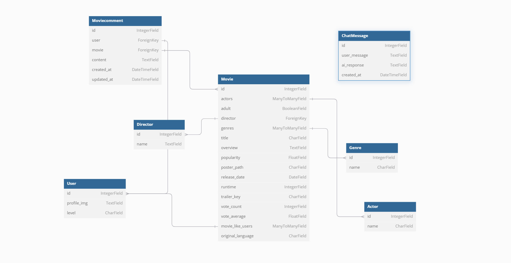

# <팀원 정보 및 업무 분담>  
### 김민정(팀장), 이현희(팀원)  
- 김민정 - 웹디자인 & CSS 모델링 & Vue Client 구현
- 이현희 - 웹크롤링 & CSS 모델링 & Django server 구현  

# <목표 서비스 구현 및 실제 구현 정도>  
### 목표 서비스  
- TMDB를 통해 영화 데이터 받아오기  
- 사용자의 영어 수준을 chat gpt를 활용하여 파악 후 사용자 개개인 수준에 맞는 영화를 추천해주는 서비스  
- 수준 별 영화 분류,  사용자의 목표 설정  
- 사용자 간의 커뮤니케이션 기능     
- 메인 페이지 화면에 랜덤으로 영화 추천하기  
- 대화 형식의 TEST 페이지 구현

### 실제 구현 정도   
- chat gpt를 활용하여 사용자의 레벨 파악하기  
- 회원가입, 로그인, 로그아웃  
- 영화 좋아요, 댓글달기  
- 레벨 별 영화 목록 조회  

# 데이터베이스 모델링(ERD)  

# 영화 추천 알고리즘
1. 프롬프트 엔지니어링 활용
2. 영어 수준을 5단계로 구분 
3. chat gpt API를 통해 user의 레벨 파악
4. 영화 장르 데이터를 통해 수준별 영화를 5개로 분류

# 핵심 기능
- 생성형 AI Chat GPT API를 활용한 TEST Page
- 생성형 AI Chat GPT API를 활용한 영화 추천
- TEST Page를 통해 사용자의 레벨 업데이트

# 느낀점
- 첫 프로젝트로 기획을 나름 했다고 생각했지만 거의 끝날 때가 되어 다시 생각해보니 1/10도 안했다는 것을 깨달았습니다. 기획쪽에서 시간을 많이 할애하지 못했다보니 후에 코드를 짜면서 문제가 되는 부분이 많이 생기게 되었습니다. 2학기부터는 초반에 최대한 자세하게 기획을 한 후 진행을 해야겠습니다. 
- 기초를 탄탄히 다져놔야겠다는 것을 느꼈고, 다른 코드를 참고할 땐 확실히 이해가 되지 않았을 때는 활용하지 않는게 옳다는 것을 느꼈습니다. GPT가 이번 관통 프로젝트에서 아주 많은 도움이 됐지만 무분별한 사용은 자제해야겠습니다.   

